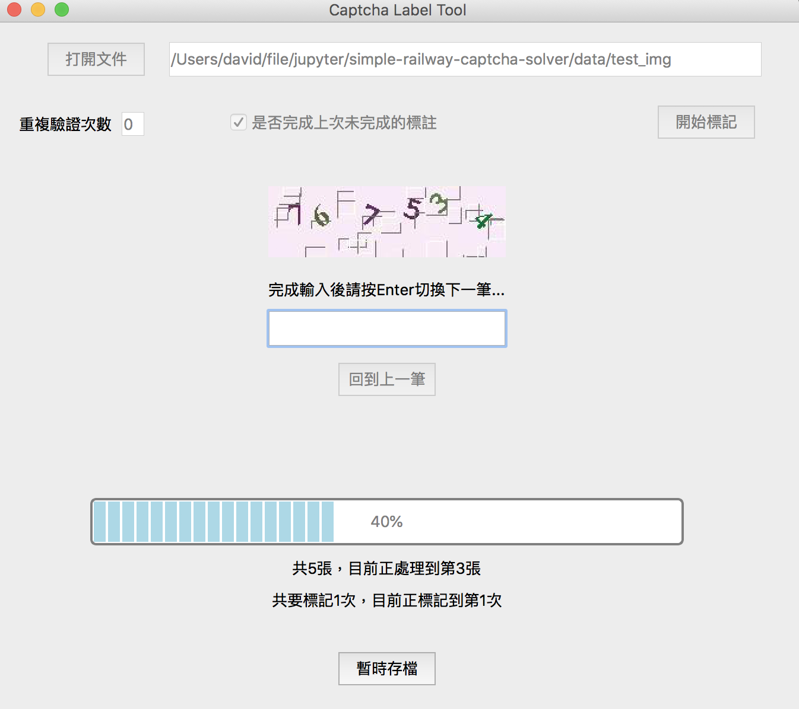

# captcha-label-tool
基於PyQt5的驗證碼標註工具


這是一個簡單的驗證碼標註工具，在需要手動大量標註驗證碼時還蠻方便的，而且比較不容易出錯。

使用時先打開存放驗證碼的目錄，然後設定重複驗證次數，即可開始標記。

完成後會在當前目錄創建```*.csv```文件，每一個row是一筆驗證碼，其中第一個column是圖片的檔名，第二個column是標註的驗證碼。

重複驗證次數如果設為1次，在第一次輸入完所有答案後，會要求重複輸入第2次答案。如果跟前一次輸入不同會提示，要求檢查後輸入確認的答案，這樣可以盡量避免標註錯誤的答案。

暫時存檔功能，會在當前目錄創建```record.txt```，紀錄當前標註的位置，以及當前已經標註答案的csv文件。下次要繼續標註時，會讓你選擇是否繼續完成上次未完成的標註。在需要標註大量的驗證碼時，可以分多次完成任務。

|Name|Description|
|----|----|
|MainWindow.ui|使用QtDesigner製作的圖形化介面|
|MainWindow.py|MainWindow.ui轉換的python文件|
|main.py|程序入口，負責所有邏輯部分|

## Dependencies(環境依賴)
|Name|Version|
|----|----|
|python|3.6|
|pyqt5|5.6|

## Running(運行)
轉換ui文件到python文件
```pyuic5 MainWindow.ui -o MainWindow.py```

啟動
```python main.py```
