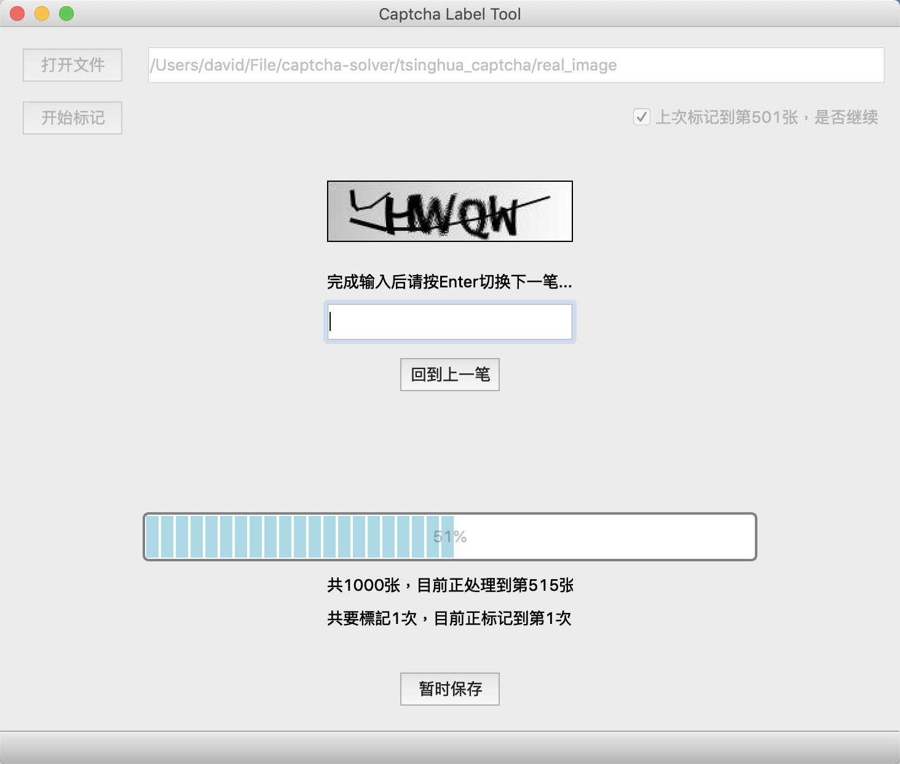

# captcha-label-tool
基於PyQt5的验证码标注工具

## Introduction(简介)

这是一个简单的验证码标注工具，在需要手动大量标注验证码是比较方便，而且比较不容易出错。

使用时先打开存放验证码的目录，然后设定需要重复验证的次数，即可开始标记。

完成后会在当前目录创建```*.csv```文件，每一个row是一笔验证码，其中第一个column是图片的文件名，第二个column是该图片标注的验证码。

~~如果重复验证次数设为1次，在第一次输入完所有答案后，会要求重复输入第2次。如果跟前一次输入不同时会有提示，会要求检查后输入确认的答案，这样可以尽量避免标注错误。~~（暂时取消该功能）

暂时存档功能，会在当前目录创建```record.txt```文件，记录当前标注的位置，以及当前已经标注好了的csv文件。下次继续标注时，可以选择继续完成上次未完成的标注任务。在需要标注大量的验证码时，可以分多次完成任务。

|Name|Description|
|:-:|:-:|
|MainWindow.ui|使用QtDesigner制作的图形化界面|
|MainWindow.py|MainWindow.ui转换的python文件|
|main.py|程序入口，负责所有逻辑部分|
|dist|打包的App文件，可在任何macos系统上执行|

## Dependencies(环境依赖)
|Name|Version|
|:-:|:-:|
|python|3.6.6|
|pyqt5|5.11.2|
|pyInstaller|3.3.1|

## Running(运行)
转换ui文件到python文件
```pyuic5 MainWindow.ui -o MainWindow.py```

启动
```python main.py```

## APP Bundle(打包成APP)
使用pyInstaller工具进行打包

第一步
```pyinstaller --windowed --clean --noconfirm --onefile main.py```

第二步
```pyinstaller --windowed --clean --noconfirm --onefile main.spec```

打包的时候遇到的一些问题：
1. 我的程序是在Anaconda下开发的，但是如果在此环境下进行pyInstaller打包，会出现PyQt库的依赖问题，与Anaconda下的PyQt库出现冲突。所以后来是在另外的python3.6环境下进行打包的。
2. pyInstaller暂时还不支援python3.7
~~3. 出现```ModuleNotFoundError: No module named 'PyQt5.sip'```这个问题，加上```--hidden-import PyQt5.sip```可以解決。~~
